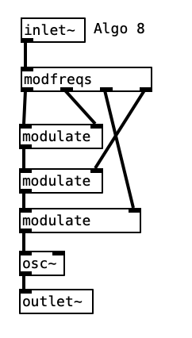

# FM-101

## Overview
FM-101 is a practice project in PureData focused on 
experimenting with frequency modulation synthesis. With 3 opeators
and the varrier frequency, I have implemented 8 different FM algorithms. While the synth itself has its quirks, I'm fairly 
satisfied with the implementation. Feel free to try it out and 
modify as you see fit!

## Using the Patch
All you need to do is open `main.pd`, setup your MIDI input device, and turn audio on (`cmd+/`). Saving the patch (`cmd+s`) will save all 
the parameters, effectively giving you one preset.

## Controls
* Volume
* Algorithm Select
* 3x Operator Ratios
* ADSR Envelope Generator
* Sweeping BP Filter

## Algorithms

### Algo-1

### Algo-2

### Algo-3

### Algo-4

### Algo-5

### Algo-6

### Algo-7

### Algo-8

